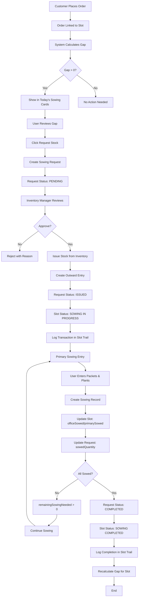
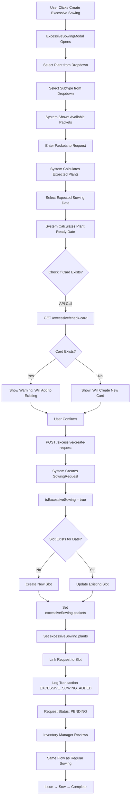
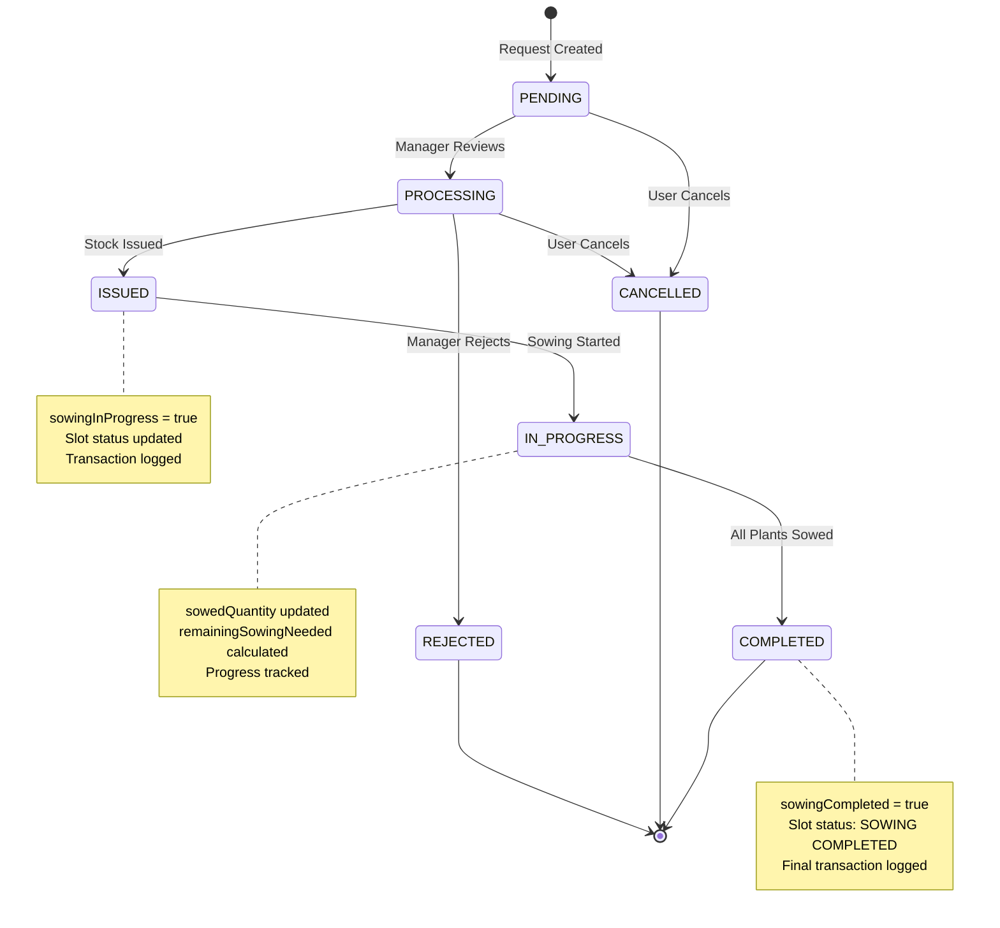
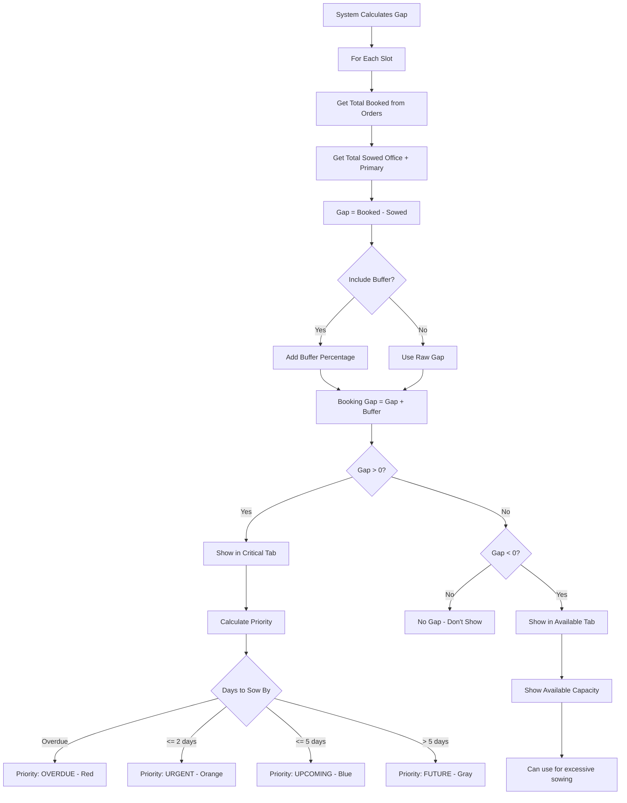
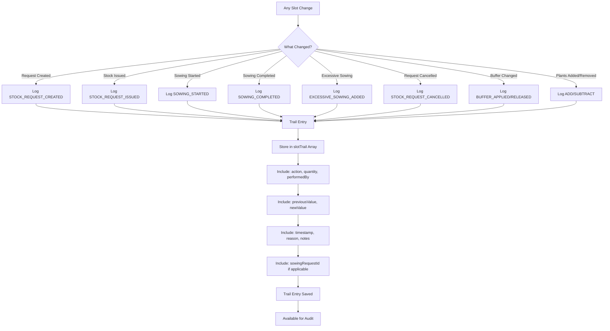

# Nursery Management - Sowing System Documentation

## Table of Contents
1. [System Overview](#system-overview)
2. [Architecture & Models](#architecture--models)
3. [System Flows](#system-flows)
4. [User Guide](#user-guide)
5. [Developer Guide](#developer-guide)
6. [API Reference](#api-reference)
7. [Database Schema](#database-schema)

---

## 1. System Overview

The Sowing System is a comprehensive plant sowing management solution that handles:
- Regular sowing based on customer orders
- Excessive sowing (sowing without orders for stock)
- Stock request management
- Progress tracking from request → issue → sowing → completion
- Real-time gap analysis and availability tracking
- Transaction logging for complete audit trail

### Key Features
✅ **Order-Based Sowing** - Calculate sowing needs based on customer orders
✅ **Excessive Sowing** - Sow plants without orders for future stock
✅ **Request Workflow** - Complete lifecycle: Request → Issue → Sow → Complete
✅ **Progress Tracking** - Real-time tracking of sowing progress
✅ **Gap Analysis** - Identify gaps between orders and sowed plants
✅ **Transaction Logging** - Every change logged with timestamp and user
✅ **WhatsApp Integration** - Send sowing reminders via WhatsApp
✅ **Multi-Location Support** - OFFICE and PRIMARY (Field) locations

---

## 2. Architecture & Models

### 2.1 Core Models

#### **PlantCms Model**
```javascript
{
  plantName: String,
  sowingAllowed: Boolean,
  subtypes: [{
    subtypeName: String,
    plantReadyDays: Number,  // Days needed for plants to be ready
    isActive: Boolean
  }]
}
```

#### **PlantSlot Model** ⭐ (Most Important)
```javascript
{
  plantId: ObjectId,
  year: Number,
  subtypeSlots: [{
    subtypeId: ObjectId,
    slots: [{
      startDay: String,        // "dd-mm-yyyy"
      endDay: String,          // "dd-mm-yyyy"
      totalPlants: Number,     // Total capacity
      availablePlants: Number, // After buffer deduction
      
      // Sowing tracking
      plantsSowed: Number,     // Total sowed (office + primary)
      officeSowed: Number,     // Office location sowed
      primarySowed: Number,    // Primary (field) sowed
      
      // Excessive sowing
      excessiveSowing: {
        packets: Number,       // Excessive packets sowed
        plants: Number         // Excessive plants sowed
      },
      
      // Progress tracking
      sowingInProgress: Boolean,
      sowingCompleted: Boolean,
      sowingCompletedDate: String,
      
      // Linked requests
      linkedSowingRequests: [ObjectId],
      
      // Transaction trail
      slotTrail: [{
        action: String,        // SOWING_STARTED, SOWING_COMPLETED, etc.
        quantity: Number,
        previousTotalPlants: Number,
        newTotalPlants: Number,
        reason: String,
        performedBy: ObjectId,
        sowingRequestId: ObjectId,
        timestamp: Date
      }],
      
      // Buffer management
      buffer: Number,
      effectiveBuffer: Number,
      bufferAmount: Number,
      
      // Orders
      orders: [ObjectId],
      
      // Dates
      sowingDate: String,
      plantReadyDate: String
    }]
  }]
}
```

#### **Sowing Model**
```javascript
{
  plantId: ObjectId,
  subtypeId: ObjectId,
  slotId: ObjectId,
  sowingDate: String,
  totalQuantityRequired: Number,
  sowedPlant: Number,
  sowingLocation: String,      // OFFICE or PRIMARY
  batchNumber: String,
  packets: [{                   // For OFFICE location
    outwardId: ObjectId,
    itemId: ObjectId,
    quantity: Number,
    batchNumber: String,
    completeSowing: Boolean,
    remainingQuantity: Number
  }],
  plantReadyDays: Number,
  plantReadyDate: String,
  reminderBeforeDays: Number,
  completeSowing: Boolean,
  notes: String,
  createdBy: ObjectId
}
```

#### **SowingRequest Model** ⭐
```javascript
{
  requestNumber: String,       // Auto-generated SR20240101XXXX
  plantId: ObjectId,
  plantName: String,
  subtypeId: ObjectId,
  subtypeName: String,
  productId: ObjectId,         // Seed product
  
  // Quantities
  packetsNeeded: Number,       // Calculated from gap
  packetsRequested: Number,    // Can be more than needed
  excessPackets: Number,       // Difference
  
  // Units & Conversion
  primaryUnit: ObjectId,
  secondaryUnit: ObjectId,
  conversionFactor: Number,    // packets → plants
  unitName: String,
  
  // Status workflow
  status: String,              // pending, processing, issued, cancelled, rejected
  requestedDate: Date,
  requestedBy: ObjectId,
  issuedDate: Date,
  issuedBy: ObjectId,
  outwardId: ObjectId,
  
  // Progress tracking
  sowingInProgress: Boolean,
  sowingStartedDate: Date,
  sowingCompleted: Boolean,
  sowingCompletedDate: Date,
  sowedQuantity: Number,       // Plants actually sowed
  remainingSowingNeeded: Number, // Plants still to sow
  
  // Links
  linkedSlotIds: [ObjectId],
  
  // Excessive sowing flag
  isExcessiveSowing: Boolean,
  
  // Rejection
  rejectedBy: ObjectId,
  rejectedDate: Date,
  rejectionReason: String,
  
  notes: String
}
```

#### **InventoryOutward Model**
```javascript
{
  purpose: String,             // "production" for sowing
  issuedTo: ObjectId,
  items: [{
    productId: ObjectId,
    batchNumber: String,
    quantity: Number,
    availableQuantity: Number,  // Remaining after use
    itemId: ObjectId
  }],
  createdBy: ObjectId,
  status: String
}
```

#### **Order Model**
```javascript
{
  orderNumber: String,
  farmer: ObjectId,
  items: [{
    plantId: ObjectId,
    subtypeId: ObjectId,
    slotId: ObjectId,
    numberOfPlants: Number
  }],
  orderStatus: String,
  orderPaymentStatus: String
}
```

### 2.2 Database Relationships

```
PlantCms (1) ----< (N) PlantSlot
                         |
                         +----< (N) SubtypeSlot
                                      |
                                      +----< (N) Slot
                                                 |
                                                 +----< (N) Order
                                                 |
                                                 +----< (N) SowingRequest
                                                 |
                                                 +----< (N) Sowing

SowingRequest (N) ----< (1) Product (Seed)
SowingRequest (1) ----< (1) InventoryOutward
SowingRequest (N) ----< (1) User (requested/issued)

Sowing (N) ----< (N) InventoryOutward.items (packets)
```

---

## 3. System Flows

### 3.1 Regular Sowing Flow (Order-Based)



### 3.2 Excessive Sowing Flow (No Orders)



### 3.3 Request Status Lifecycle



### 3.4 Gap Analysis Flow



### 3.5 Transaction Logging Flow



---

## 4. User Guide

### 4.1 For Sowing Managers

#### **Viewing Today's Sowing Needs**

1. Navigate to **Sowing Gap Analysis** page
2. View **"Today's Sowing (Due & Current Day)"** section
3. Cards show:
   - Plant name and subtype
   - Total plants needed
   - Packets needed (if conversion factor configured)
   - Number of slots
   - Available stock status

#### **Creating Stock Request (Regular Sowing)**

1. Find the card for plant/subtype you need to sow
2. Click **"Request Stock"** button
3. System shows:
   - Packets Needed (calculated from gap)
   - Available packets in inventory
4. Enter packets to request (can be more than needed)
5. If requesting more, system shows excess amount
6. Click **"Confirm"** to create request
7. Request is sent to inventory manager

#### **Creating Excessive Sowing (No Orders)**

1. Click **"Create Excessive Sowing"** button (green button in header)
2. Select plant from dropdown
3. Select subtype from dropdown
4. System shows:
   - Product details
   - Conversion factor
   - Available packets
   - Plant ready days
5. Enter packets to request
6. System calculates expected plants automatically
7. Select expected sowing date
8. System shows plant ready date automatically
9. Add notes (optional)
10. Click **"Create Request"**
11. System checks if card exists:
    - If exists: Adds to existing card
    - If not: Creates new card

#### **Requesting All Cards at Once**

1. View today's sowing cards
2. Click **"Request All"** button
3. System creates requests for all cards that:
   - Have conversion factor configured
   - Don't have pending/issued requests
   - Have available gaps
4. View success summary showing:
   - Number of requests created
   - Number of failures (if any)

#### **Printing Sowing Report**

1. Click **"Print"** button
2. System generates PDF with:
   - Sowing summary (all cards)
   - Packets needed for each
   - Orders by slot
   - Total quantities
3. Use browser print dialog to save/print

#### **Tracking Request Status**

1. Request statuses:
   - 🟡 **Pending**: Waiting for manager approval
   - 🟠 **Processing**: Under review
   - 🟢 **Issued**: Stock issued, ready to sow
   - 🔴 **Rejected**: Request rejected (see reason)
   - ⚫ **Cancelled**: Request cancelled

2. Cards show current request status with color coding
3. For issued requests:
   - "Stock Issued" chip appears (green)
   - Ready to proceed with sowing

#### **Cancelling Requests**

1. Find card with pending/processing request
2. Click **"Cancel Request"** button
3. Confirm cancellation
4. Request status changes to cancelled
5. Can create new request if needed

### 4.2 For Inventory Managers

#### **Reviewing Pending Requests**

1. Navigate to **Inventory → Sowing Requests**
2. View all pending requests
3. For each request, see:
   - Request number
   - Plant and subtype
   - Packets needed vs requested
   - Excess packets (if any)
   - Requesting user
   - Request date

#### **Issuing Stock**

1. Select request to issue
2. Click **"Issue Stock"**
3. System creates outward entry automatically
4. Stock is deducted from inventory
5. Request status changes to "Issued"
6. Sowing manager can now proceed with sowing

#### **Rejecting Requests**

1. Select request to reject
2. Click **"Reject"**
3. Enter rejection reason
4. Request status changes to "Rejected"
5. Sowing manager is notified

### 4.3 For Primary Sowing Staff

#### **Entering Sowing Data (Mobile-Optimized)**

1. Navigate to **Primary Sowing Entry** (mobile app)
2. View available packets automatically loaded
3. For each plant/subtype card:
   - **Packets field**: Amount of seed packets used
   - **Primary (Field) field**: Number of plants sowed
4. Select sowing date
5. System shows plant ready date automatically
6. Click **"Review"** to see summary
7. Verify all entries
8. Click **"Confirm & Save"**

#### **Understanding Auto-Fill Logic**

- Clicking a card auto-fills:
  - Packets = Available quantity
  - Primary = Packets × Conversion Factor
- Editing Packets auto-fills Primary
- Editing Primary does NOT auto-fill Packets (manual override)
- System validates: Primary ≤ (Packets × CF × 1.1)

#### **Handling Decimal Entries**

- If you enter decimal in Packets (e.g., 0.5):
  - System automatically marks as "Complete Sowing"
  - Remaining packets returned to inventory
  - Plant ready days set to 0 (won't show next day)

#### **Sharing Sowing Summary (WhatsApp)**

1. After reviewing, click **"Share on WhatsApp"**
2. System generates beautiful message with:
   - All sowing details
   - Plant ready dates
   - Batch numbers
3. Message copied to clipboard automatically
4. WhatsApp opens (or use copied message)
5. Share with team

---

## 5. Developer Guide

### 5.1 Project Structure

```
FINAL_NURSERY_BE/
├── models/
│   ├── plantCms.model.js          # Plant master data
│   ├── slots.model.js             # ⭐ Slot management
│   ├── sowing.model.js            # Sowing records
│   ├── sowingRequest.model.js     # ⭐ Request lifecycle
│   ├── order.model.js             # Customer orders
│   ├── inventoryOutward.model.js  # Stock issues
│   └── product.model.js           # Seed products
│
├── controllers/
│   ├── sowing.controller.js               # Main sowing CRUD
│   ├── sowingRequest.controller.js        # Request management
│   ├── excessiveSowing.controller.js      # ⭐ Excessive sowing
│   ├── sowingRequestProgress.controller.js # ⭐ Progress tracking
│   └── sowingWhatsApp.controller.js       # WhatsApp integration
│
├── helpers/
│   └── slotTransactionLogger.js   # ⭐ Transaction logging utility
│
└── routes/
    └── sowing.route.js            # All sowing routes

nursery-mgmt/src/
├── pages/private/Sowing/
│   ├── SowingGapAnalysis.js      # Main UI
│   ├── PrimarySowingEntry.jsx    # Mobile sowing entry
│   └── SowingManagement.js       # Sowing management
│
├── components/Modals/
│   ├── ExcessiveSowingModal.jsx  # ⭐ Excessive sowing modal
│   └── MotivationalQuoteModal.jsx
│
└── network/config/
    └── endpoints.js               # API endpoints
```

### 5.2 Key Algorithms

#### **Gap Calculation Algorithm**

```javascript
function calculateBookingGap(slot, orders) {
  // Step 1: Calculate total booked from orders
  const totalBooked = orders
    .filter(o => o.items.some(i => i.slotId === slot._id))
    .reduce((sum, order) => {
      const item = order.items.find(i => i.slotId === slot._id);
      return sum + (item?.numberOfPlants || 0);
    }, 0);
  
  // Step 2: Calculate total sowed
  const totalSowed = (slot.officeSowed || 0) + (slot.primarySowed || 0);
  
  // Step 3: Calculate raw gap
  const rawGap = totalBooked - totalSowed;
  
  // Step 4: Apply buffer if configured
  const bufferPercentage = slot.effectiveBuffer || slot.buffer || 0;
  const bufferAmount = Math.round((rawGap * bufferPercentage) / 100);
  
  // Step 5: Calculate final booking gap
  const bookingGap = rawGap + bufferAmount;
  
  return {
    totalBooked,
    totalSowed,
    rawGap,
    bufferAmount,
    bookingGap,
    bookingGapRaw: rawGap  // Without buffer
  };
}
```

#### **Progress Tracking Algorithm**

```javascript
function updateSowingProgress(request, sowedQuantity) {
  // Step 1: Update sowed quantity
  request.sowedQuantity = (request.sowedQuantity || 0) + sowedQuantity;
  
  // Step 2: Calculate expected plants
  const expectedPlants = request.packetsRequested * request.conversionFactor;
  
  // Step 3: Calculate remaining
  request.remainingSowingNeeded = Math.max(0, expectedPlants - request.sowedQuantity);
  
  // Step 4: Check completion
  if (request.remainingSowingNeeded <= 0) {
    request.sowingCompleted = true;
    request.sowingCompletedDate = new Date();
    request.sowingInProgress = false;
  } else if (!request.sowingInProgress) {
    request.sowingInProgress = true;
    request.sowingStartedDate = new Date();
  }
  
  // Step 5: Calculate progress percentage
  const progressPercentage = expectedPlants > 0
    ? Math.min(100, Math.round((request.sowedQuantity / expectedPlants) * 100))
    : 0;
  
  return {
    sowedQuantity: request.sowedQuantity,
    remainingSowing: request.remainingSowingNeeded,
    progressPercentage,
    isCompleted: request.sowingCompleted
  };
}
```

#### **Priority Calculation Algorithm**

```javascript
function calculatePriority(slot, sowByDate) {
  const today = moment();
  const sowBy = moment(sowByDate, 'DD-MM-YYYY');
  const daysUntilSow = sowBy.diff(today, 'days');
  
  if (daysUntilSow < 0) {
    return 'overdue';      // Red - Past due date
  } else if (daysUntilSow <= 2) {
    return 'urgent';       // Orange - 0-2 days
  } else if (daysUntilSow <= 5) {
    return 'upcoming';     // Blue - 3-5 days
  } else {
    return 'future';       // Gray - > 5 days
  }
}
```

### 5.3 Important Middleware & Helpers

#### **Slot Transaction Logger**

```javascript
import {
  logSowingRequestCreated,
  logSowingRequestIssued,
  logSowingStarted,
  logSowingCompleted,
  logExcessiveSowingAdded
} from '../helpers/slotTransactionLogger.js';

// Usage in controller
const slot = await findSlot(slotId);

// Log request creation
logSowingRequestCreated(slot, requestId, quantity, userId, {
  isExcessive: true,
  notes: 'Custom note'
});

await slot.save(); // Saves trail automatically
```

#### **Transaction Trail Structure**

```javascript
{
  action: 'SOWING_STARTED',        // Action type
  quantity: 1000,                   // Quantity involved
  previousTotalPlants: 5000,        // State before
  newTotalPlants: 5000,             // State after
  previousAvailablePlants: 2000,
  newAvailablePlants: 1000,
  bufferPercentage: 10,
  bufferAmount: 500,
  reason: 'Sowing started at OFFICE',
  performedBy: userId,
  sowingRequestId: requestId,       // Optional
  notes: 'Detailed notes',
  createdAt: Date,
  updatedAt: Date
}
```

### 5.4 API Implementation Examples

#### **Creating Excessive Sowing Request**

```javascript
// POST /api/v1/sowing/excessive/create-request
export const createExcessiveSowingRequest = async (req, res) => {
  const { plantId, subtypeId, packetsRequested, sowingDate } = req.body;
  
  // 1. Validate plant and subtype
  const plant = await PlantCms.findById(plantId);
  const subtype = plant.subtypes.id(subtypeId);
  
  // 2. Get product and conversion factor
  const product = await Product.findOne({ plantId, 'plantSubtypeInfo.subtypeId': subtypeId });
  const conversionFactor = product.plantSubtypeInfo[0].conversionFactor;
  
  // 3. Generate request number
  const requestNumber = await SowingRequest.generateRequestNumber();
  
  // 4. Create request
  const request = await SowingRequest.create({
    requestNumber,
    plantId,
    subtypeId,
    packetsRequested,
    conversionFactor,
    isExcessiveSowing: true,
    status: 'pending',
    requestedBy: req.user._id
  });
  
  // 5. Find or create slot
  const slot = await findOrCreateSlot(plantId, subtypeId, sowingDate);
  
  // 6. Update slot with excessive sowing
  slot.excessiveSowing.packets += packetsRequested;
  slot.excessiveSowing.plants += packetsRequested * conversionFactor;
  
  // 7. Log transaction
  logExcessiveSowingAdded(slot, packetsRequested, 
    packetsRequested * conversionFactor, req.user._id);
  
  await slot.save();
  
  return res.json({ success: true, data: request });
};
```

#### **Updating Sowing Progress**

```javascript
// PUT /api/v1/sowing/request/:requestId/update-progress
export const updateSowingProgress = async (req, res) => {
  const { requestId } = req.params;
  const { sowedQuantity, slotId } = req.body;
  
  // 1. Get request
  const request = await SowingRequest.findById(requestId);
  
  // 2. Update quantities
  request.sowedQuantity += sowedQuantity;
  const expectedPlants = request.packetsRequested * request.conversionFactor;
  request.remainingSowingNeeded = Math.max(0, expectedPlants - request.sowedQuantity);
  
  // 3. Check completion
  if (request.remainingSowingNeeded <= 0) {
    request.sowingCompleted = true;
    request.sowingCompletedDate = new Date();
    request.sowingInProgress = false;
  }
  
  await request.save();
  
  // 4. Update slot
  if (slotId) {
    const slot = await findSlot(slotId);
    
    if (request.sowingCompleted) {
      logSowingCompleted(slot, request.sowedQuantity, req.user._id);
    }
    
    await slot.save();
  }
  
  return res.json({ success: true, data: request });
};
```

### 5.5 Testing Guidelines

#### **Unit Tests**

```javascript
// Test gap calculation
describe('Gap Calculation', () => {
  it('should calculate gap without buffer', () => {
    const result = calculateBookingGap(slot, orders);
    expect(result.rawGap).toBe(1000);
    expect(result.bufferAmount).toBe(0);
    expect(result.bookingGap).toBe(1000);
  });
  
  it('should calculate gap with buffer', () => {
    slot.buffer = 10;
    const result = calculateBookingGap(slot, orders);
    expect(result.bufferAmount).toBe(100);
    expect(result.bookingGap).toBe(1100);
  });
});

// Test progress tracking
describe('Progress Tracking', () => {
  it('should mark as in progress when first sowing', () => {
    updateSowingProgress(request, 500);
    expect(request.sowingInProgress).toBe(true);
    expect(request.sowingCompleted).toBe(false);
  });
  
  it('should mark as completed when all sowed', () => {
    updateSowingProgress(request, 1000);
    expect(request.sowingCompleted).toBe(true);
    expect(request.sowingInProgress).toBe(false);
  });
});
```

#### **Integration Tests**

```javascript
// Test excessive sowing flow
describe('Excessive Sowing Flow', () => {
  it('should create request and update slot', async () => {
    const response = await request(app)
      .post('/api/v1/sowing/excessive/create-request')
      .send({
        plantId: testPlantId,
        subtypeId: testSubtypeId,
        packetsRequested: 10,
        sowingDate: '25-12-2024'
      });
    
    expect(response.body.success).toBe(true);
    expect(response.body.data.isExcessiveSowing).toBe(true);
    
    // Verify slot updated
    const slot = await findSlot(response.body.data.linkedSlotIds[0]);
    expect(slot.excessiveSowing.packets).toBe(10);
  });
});
```

### 5.6 Performance Optimization

#### **Database Indexes**

```javascript
// Slot model indexes
plantSlotSchema.index({ plantId: 1, year: 1 });
plantSlotSchema.index({ 'subtypeSlots.subtypeId': 1 });
plantSlotSchema.index({ 'subtypeSlots.slots._id': 1 });

// Sowing request indexes
sowingRequestSchema.index({ plantId: 1, subtypeId: 1 });
sowingRequestSchema.index({ status: 1 });
sowingRequestSchema.index({ requestedDate: -1 });
```

#### **Aggregation Pipelines**

```javascript
// Efficient gap calculation for all plants
const pipeline = [
  // Match active plants
  { $match: { isActive: true, sowingAllowed: true } },
  
  // Lookup slots
  { $lookup: {
      from: 'plantslots',
      localField: '_id',
      foreignField: 'plantId',
      as: 'slots'
  }},
  
  // Unwind and calculate
  { $unwind: '$slots' },
  { $unwind: '$slots.subtypeSlots' },
  { $unwind: '$slots.subtypeSlots.slots' },
  
  // Group and aggregate
  { $group: {
      _id: { plantId: '$_id', subtypeId: '$slots.subtypeSlots.subtypeId' },
      totalGap: { $sum: '$slots.subtypeSlots.slots.bookingGap' }
  }}
];
```

### 5.7 Error Handling

```javascript
// Centralized error handler
export const handleError = (res, error, message = 'Operation failed') => {
  console.error(message, error);
  
  return res.status(error.statusCode || 500).json({
    success: false,
    message: error.message || message,
    error: process.env.NODE_ENV === 'development' ? error.stack : undefined
  });
};

// Usage in controllers
try {
  // ... controller logic
} catch (error) {
  return handleError(res, error, 'Failed to create request');
}
```

---

## 6. API Reference

### 6.1 Sowing APIs

#### **Create Sowing**
```
POST /api/v1/sowing
Body: {
  plantId, subtypeId, sowingDate, totalQuantityRequired,
  sowedPlant, sowingLocation, batchNumber, packets, notes
}
Response: { success, data: sowing }
```

#### **Create Multiple Sowings**
```
POST /api/v1/sowing/multiple
Body: { sowings: [...] }
Response: { success, failed, data }
```

#### **Get Plant Reminders**
```
GET /api/v1/sowing/plant-reminders?plantId=xxx&subtypeId=xxx&gapFilter=positive
Response: { success, reminders, summary }
```

### 6.2 Sowing Request APIs

#### **Create Request (Regular)**
```
POST /api/v1/sowing/request/create
Body: { plantId, subtypeId, packetsNeeded, packetsRequested, notes }
Response: { success, data: request }
```

#### **Check Request Exists**
```
GET /api/v1/sowing/request/check?plantId=xxx&subtypeId=xxx
Response: { success, exists, data }
```

#### **Get Active Requests**
```
GET /api/v1/sowing/request/active?status=issued
Response: { success, count, data: [...requests] }
```

#### **Get Request Status**
```
GET /api/v1/sowing/request/:requestId/status
Response: { success, data: { request, progress, slot, recentSowings } }
```

#### **Mark Request as Issued**
```
PUT /api/v1/sowing/request/:requestId/mark-issued
Body: { outwardId }
Response: { success, data: request }
```

#### **Update Sowing Progress**
```
PUT /api/v1/sowing/request/:requestId/update-progress
Body: { sowedQuantity, slotId }
Response: { success, data: { request, remainingSowing, isCompleted } }
```

#### **Recalculate Remaining**
```
POST /api/v1/sowing/request/:requestId/recalculate
Response: { success, data: { expectedPlants, totalSowed, remaining } }
```

#### **Issue Stock**
```
POST /api/v1/sowing/request/:id/issue
Body: { exactQuantity }
Response: { success, data: { request, outward } }
```

#### **Cancel Request**
```
POST /api/v1/sowing/request/:id/cancel
Response: { success, message }
```

### 6.3 Excessive Sowing APIs

#### **Create Excessive Request**
```
POST /api/v1/sowing/excessive/create-request
Body: { plantId, subtypeId, packetsRequested, sowingDate, notes }
Response: { success, data: { request, slot } }
```

#### **Get Available Plants**
```
GET /api/v1/sowing/excessive/available-plants
Response: { success, data: [{ plantId, plantName, subtypes: [...] }] }
```

#### **Check Card Exists**
```
GET /api/v1/sowing/excessive/check-card/:plantId/:subtypeId
Response: { success, exists, data: { slots } }
```

### 6.4 Gap Analysis APIs

#### **Get Plants Gap Summary**
```
GET /api/v1/sowing/plants-gap-summary?available=true
Response: { success, summary, plants }
```

#### **Get Today's Sowing Cards**
```
GET /api/v1/sowing/today-sowing-cards
Response: { success, summary, subtypeCards }
```

#### **Get Slot Orders**
```
GET /api/v1/sowing/slot-orders/:slotId
Response: { success, slotInfo, summary, orders }
```

---

## 7. Database Schema

### 7.1 Collections

```
plantcms           # Plant master data
plantslots         # Slot management (main collection)
sowings            # Sowing records
sowingrequests     # Request lifecycle
orders             # Customer orders
inventoryoutwards  # Stock issues
products           # Seed products
batches            # Batch tracking
users              # User management
```

### 7.2 Key Indexes

```javascript
// PlantSlot indexes
db.plantslots.createIndex({ plantId: 1, year: 1 });
db.plantslots.createIndex({ "subtypeSlots.subtypeId": 1 });
db.plantslots.createIndex({ "subtypeSlots.slots._id": 1 });

// SowingRequest indexes
db.sowingrequests.createIndex({ plantId: 1, subtypeId: 1 });
db.sowingrequests.createIndex({ status: 1 });
db.sowingrequests.createIndex({ requestNumber: 1 }, { unique: true });
db.sowingrequests.createIndex({ requestedDate: -1 });

// Sowing indexes
db.sowings.createIndex({ plantId: 1, subtypeId: 1, slotId: 1 });
db.sowings.createIndex({ sowingDate: 1 });
db.sowings.createIndex({ createdAt: -1 });
```

### 7.3 Sample Documents

#### **Slot Document**
```json
{
  "_id": "675a1b2c3d4e5f6g7h8i9j0k",
  "plantId": "675a1b2c3d4e5f6g7h8i9j0a",
  "year": 2024,
  "subtypeSlots": [{
    "subtypeId": "675a1b2c3d4e5f6g7h8i9j0b",
    "slots": [{
      "_id": "675a1b2c3d4e5f6g7h8i9j0c",
      "startDay": "25-12-2024",
      "endDay": "25-12-2024",
      "totalPlants": 10000,
      "availablePlants": 9000,
      "plantsSowed": 5000,
      "officeSowed": 3000,
      "primarySowed": 2000,
      "excessiveSowing": {
        "packets": 10,
        "plants": 1000
      },
      "sowingInProgress": true,
      "sowingCompleted": false,
      "linkedSowingRequests": ["675a1b2c3d4e5f6g7h8i9j0d"],
      "slotTrail": [{
        "action": "SOWING_STARTED",
        "quantity": 1000,
        "performedBy": "675a1b2c3d4e5f6g7h8i9j0e",
        "createdAt": "2024-12-18T10:00:00.000Z"
      }],
      "buffer": 10,
      "month": "December"
    }]
  }]
}
```

#### **SowingRequest Document**
```json
{
  "_id": "675a1b2c3d4e5f6g7h8i9j0d",
  "requestNumber": "SR202412180001",
  "plantId": "675a1b2c3d4e5f6g7h8i9j0a",
  "plantName": "Tomato",
  "subtypeId": "675a1b2c3d4e5f6g7h8i9j0b",
  "subtypeName": "Hybrid",
  "productId": "675a1b2c3d4e5f6g7h8i9j0f",
  "packetsNeeded": 8.5,
  "packetsRequested": 10,
  "excessPackets": 1.5,
  "conversionFactor": 100,
  "status": "issued",
  "requestedBy": "675a1b2c3d4e5f6g7h8i9j0e",
  "requestedDate": "2024-12-18T09:00:00.000Z",
  "issuedBy": "675a1b2c3d4e5f6g7h8i9j0g",
  "issuedDate": "2024-12-18T09:30:00.000Z",
  "outwardId": "675a1b2c3d4e5f6g7h8i9j0h",
  "sowingInProgress": true,
  "sowedQuantity": 500,
  "remainingSowingNeeded": 500,
  "linkedSlotIds": ["675a1b2c3d4e5f6g7h8i9j0c"],
  "isExcessiveSowing": false
}
```

---

## 8. Troubleshooting

### Common Issues

#### **Gap not showing in UI**
- Check if orders exist for the slot
- Verify slot has `totalBookedPlants > primarySowed + officeSowed`
- Check if buffer is configured correctly
- Verify slot date is today or overdue

#### **Request not getting created**
- Check if conversion factor is configured in product
- Verify product exists with purpose "production"
- Check if primary/secondary units are set
- Verify user has permission to create requests

#### **Stock not issuing**
- Check available quantity in inventory
- Verify batch number matches
- Check if product is active
- Verify outward entry is created

#### **Progress not updating**
- Check if request status is "issued"
- Verify sowedQuantity is being passed correctly
- Check if slot is linked to request
- Verify calculation: expectedPlants = packets × conversionFactor

---

## 9. Best Practices

### For Developers

1. **Always use transaction logger** - Don't update slots without logging
2. **Validate before save** - Check all required fields before saving
3. **Use aggregation for reports** - Don't loop through documents
4. **Index frequently queried fields** - Especially status, dates
5. **Handle errors gracefully** - Return meaningful error messages
6. **Test edge cases** - Zero quantities, decimal packets, etc.
7. **Document complex logic** - Add comments for algorithms

### For Users

1. **Review requests daily** - Don't let requests pile up
2. **Check inventory before requesting** - Avoid rejected requests
3. **Use excessive sowing wisely** - Only for genuine future needs
4. **Verify data before confirming** - Double-check quantities
5. **Print reports regularly** - Keep paper trail
6. **Cancel unused requests** - Keep system clean

---

## 10. Future Enhancements

### Planned Features

- [ ] Mobile app for field staff
- [ ] Barcode scanning for packets
- [ ] Automated reminders via SMS
- [ ] Weather integration for sowing suggestions
- [ ] ML-based demand forecasting
- [ ] Multi-location inventory sync
- [ ] Real-time dashboard for managers
- [ ] Photo upload for sowing verification
- [ ] GPS tracking for field sowing
- [ ] Voice commands for data entry

---

## 11. Support & Contact

### For Issues
- Email: support@nursery.com
- Phone: +91-XXXXXXXXXX
- Slack: #sowing-support

### For Feature Requests
- Create issue on GitHub
- Email: features@nursery.com

### Documentation Updates
- Last Updated: December 18, 2024
- Version: 1.0.0
- Maintained by: Development Team

---

**© 2024 Nursery Management System. All rights reserved.**


